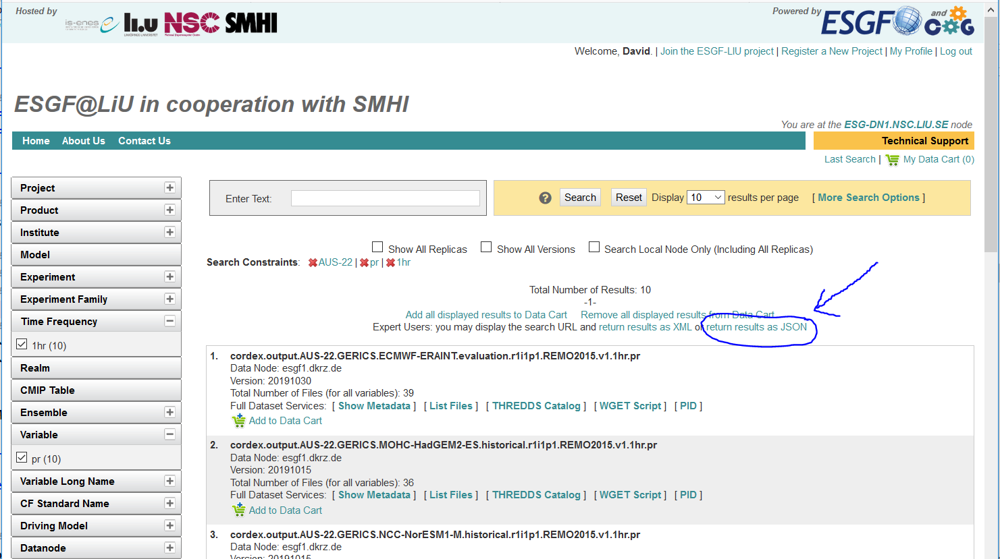

# CORDEX_Download
Routines to download limited grid extents from CORDEX using opendap.

David.Rayner@gu.se

### What you will need:

```
import json
import os
import re

from netCDF4 import Dataset
import numpy as np
from pydap.client import open_url
from pydap.cas.esgf import setup_session
from siphon.catalog import TDSCatalog
import xarray as xr
```

In addition, you must rename config_RENAME_ME.py to config.py and add your openid! Also, configure the tmpdirname variable in config.py

### What else you will need:

An openid so you can download data from https://esg-dn1.nsc.liu.se/projects/esgf-liu/ There must be instructions, I'm sure you can find them...

Note: Before you can download anything with opendap you need to be a member of a group, accept terms and conditions etc. In short: download a file through the web-browser first, <u>then</u> try to download it with CORDEX_Download!

### And there's more:

You need to get a list of the data you want to download! https://esg-dn1.nsc.liu.se/projects/esgf-liu/ and select down to the datasets you want, then click "return results as JSON"




### Basic usage:

With your config.py edited, try running CORDEX_download_Example.py

Note that the grid extent is defined in rotated coordinates, so it might take a bit of trial-and error to download the sub-grid you want. Also, I don't think all models for a given CORDEX domain use the same grid extent, so you probably will need different extents for different RCMs!

If you want to test extents, you can download just data from a single url by editing the JSONParser output:

```
  p=JSONParser(ModelSelectionFilename)

  catalog = p.Catalog[0]

  catalog.datasets = [catalog.datasets[0],]
```

and then open that file and check it out.

If you want to download just a few pixels from lots of models, you can build on the DownloadPoints function. No support for concatenation or reading a JSON file, but you give it latitude and longitudes, not grid coordinates. 

